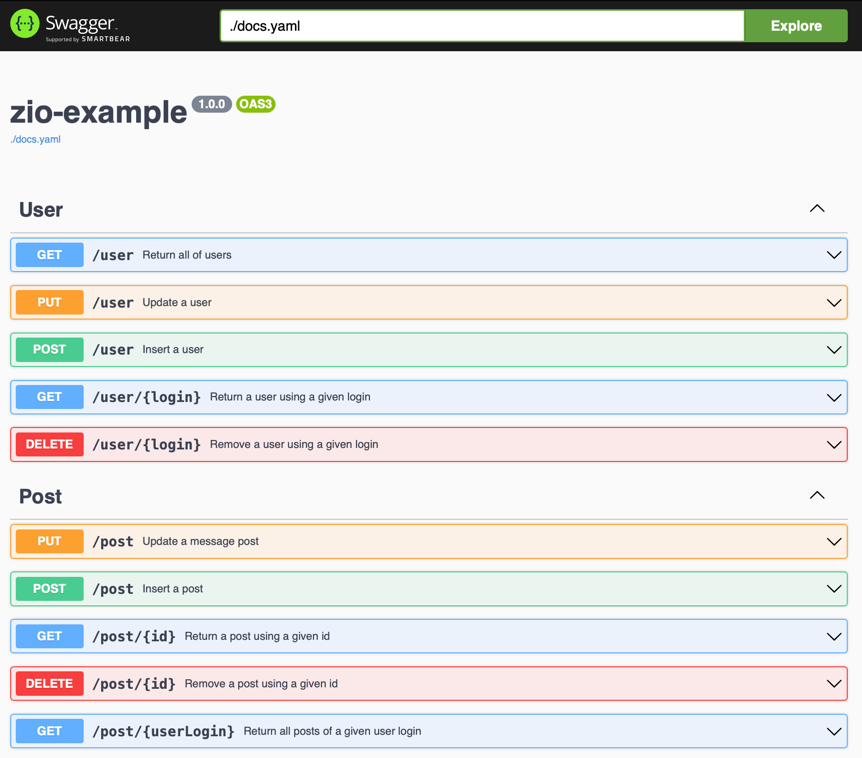

# Scala/ZIO 2.x: Postgres/Slick/Tapir/zio-http Example

This example illustrates use of:

- **Postgres** database and **Slick** for data access
- **Tapir**/**zio-http** for building the underlying REST API with **Swagger** UI. 

As Slick does not provide support for ZIO, **zio-slick-interop** is used to ensure a bottom-up use of zio as far as possible.

This example also:

- Leverages the ZIO dependencies injection pattern **ZLayer** (IoC)
- Provides some database integration tests by combining **zio-test** and **test-container**
- Use **zio-prelude** ZValidation to ensure that data model objects are always clean and validated

## References

- [ZIO](https://zio.dev)
- [Introduction to Dependency injection in ZIO](https://zio.dev/reference/di/)
- [ZIO validation with ZValidation from zio Prelude](https://zio.github.io/zio-prelude/docs/functionaldatatypes/zvalidation)
- [Introduction to ZIO Test](https://zio.dev/reference/test/)
- [Provides idiomatic, easy-to-use ZLayers for Testcontainers-scala](https://github.com/scottweaver/testcontainers-for-zio)
- [Slick library for Scala](https://scala-slick.org/doc/3.3.0/introduction.html)
- [zio-slick-interop, small library, that provides interop between Slick and ZIO](https://github.com/ScalaConsultants/zio-slick-interop)
- [Introduction to ZIO http](https://zio.dev/zio-http/)
- [Tapir, running as a zio-http server](https://tapir.softwaremill.com/en/latest/server/ziohttp.html)

## Running a Postgres docker container and running the example

Before running the example and/or tests, you need a Postgres image and a running container:

    $ docker run -d --name zio-example-postgres -p 5432:5432 -e POSTGRES_PASSWORD=password postgres

Pay attention to the configuration file settings to correctly address the postgres container:

    example = {
        driver = "org.postgresql.Driver",
        url = "jdbc:postgresql://localhost:5432/postgres",
        user = "postgres",
        password = "password",
        connectionPool = disabled
    }

To run the example, type `$ sbt run`

## The data model

The object data model resides in the [model](./src/main/scala/com/github/xvthomas/zioexample/persistence/model) package.
This quite dummy model is composed by two tables: **User** and **Post**.

**User**

| Field   | Data type  | Description       | Constraint                                                   |
| ------- | ---------- |-------------------|--------------------------------------------------------------|
| login   | String     | id of a user      | Primary key, Not empty, Length must be upper or equal than 6 |
| email   | String     | Email of the user | Not Null, Must be a valid email                              |

**Post**

| Field        | Data type  | Description                  | Constraint  |
| ------------ |------------|------------------------------|-------------|
| id           | Long       | id of a post                 | Primary key |
| dateOfIssue  | Instant    | Date of issue                | Not Null    |
| userLogin    | String     | The user who issued the post | Foreign key (User) |
| message      | String     | The message                  | Not Null, Not empty |

## Http server

This example provides a simple REST API for managing users and posts, based on zio-http.
As currently this library is not yet available within the official dev.zio ecosystem,
the maven version is used (zhttp@io.d11). Hope zio-http@dev.zio will be soon available and would provide test server features.
This example leverages tapir capabilities for swagger docs and UI.
Try [http://localhost:8080/docs/]() to get the swagger UI. 

